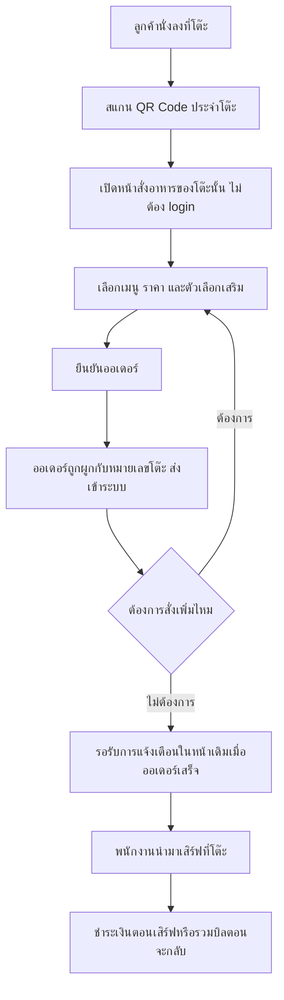
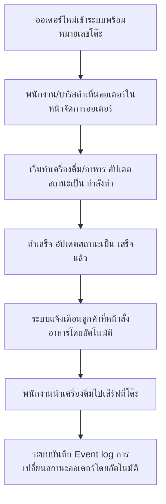
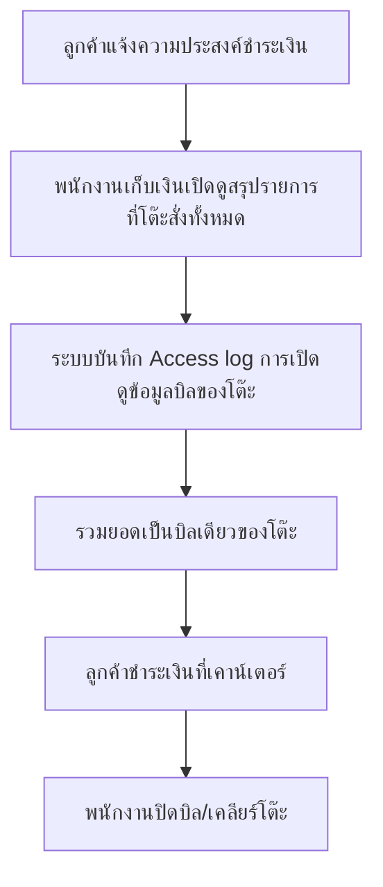
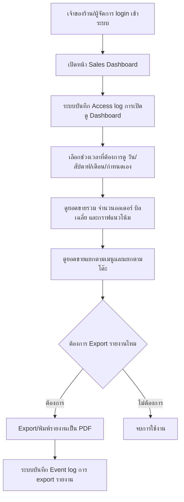
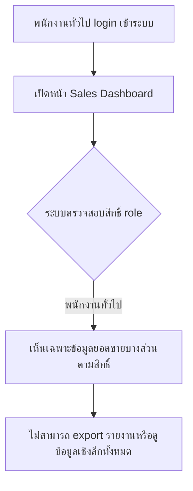
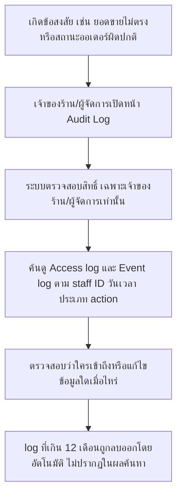
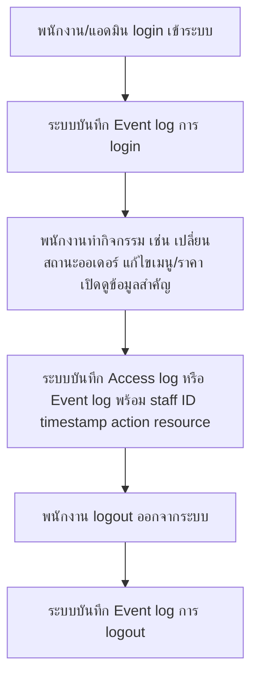
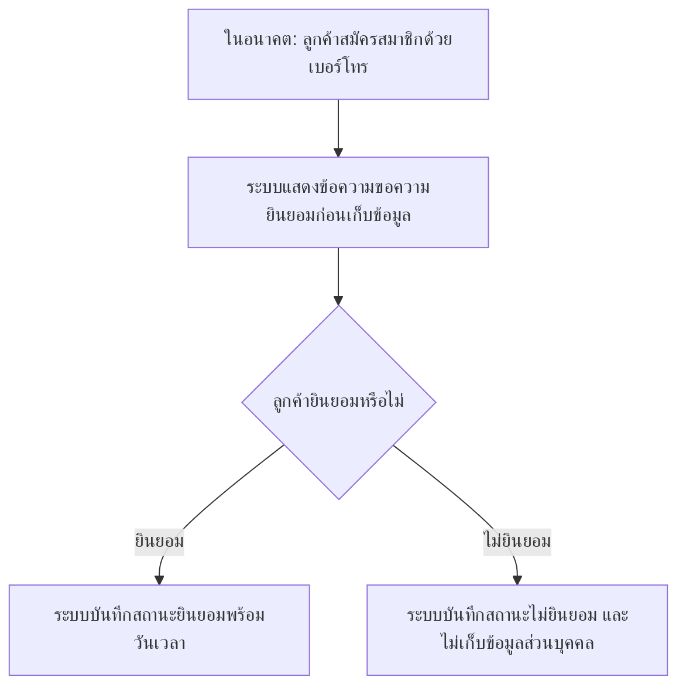

# User Journey

> อัปเดตล่าสุดเมื่อ 2026-08-15 จาก spec ทั้งหมด 3 ฉบับ (ดู [[../../01-requirements/02-plan/feature-list|feature-list]] ประกอบ)

## Journey: ลูกค้า — สั่งอาหารด้วยตนเองจากโต๊ะผ่าน QR Code

**คำอธิบายและ mapping กลับไป requirement:**

1. **ลูกค้า** นั่งลงที่โต๊ะ → touchpoint: โต๊ะในร้าน → ระบบ: ยังไม่มีการโต้ตอบใดๆ
   - (ขั้นตอนเสริมเพื่อความต่อเนื่องของ flow ไม่ได้มาจาก spec โดยตรง)
2. **ลูกค้า** สแกน QR code ที่ติดอยู่บนโต๊ะ → touchpoint: QR code บนโต๊ะ → ระบบ: เปิด session ผูกกับหมายเลขโต๊ะ
   - อ้างอิง: [[../../01-requirements/01-spec/20260802-001-table-self-order|Table Self-Order]] — Feature Requirements ข้อ "ลูกค้าสแกน QR code ที่ติดอยู่บนโต๊ะ" และ Business Rule "1 QR code ผูกกับ 1 หมายเลขโต๊ะเท่านั้น"
3. **ระบบ** เปิดหน้าสั่งอาหารของโต๊ะนั้นโดยไม่ต้องติดตั้งแอปหรือ login → touchpoint: หน้าเว็บสั่งอาหาร → ระบบ: แสดงเมนูของร้าน
   - อ้างอิง: [[../../01-requirements/01-spec/20260802-001-table-self-order|Table Self-Order]] — Feature Requirements ข้อ "เปิดหน้าสั่งอาหาร/เครื่องดื่มของโต๊ะนั้นโดยเฉพาะ (ไม่ต้องติดตั้งแอป ไม่ต้อง login)"
4. **ลูกค้า** เลือกเมนู ราคา และตัวเลือกเสริม เช่น ระดับความหวาน ชนิดนม → touchpoint: หน้าสั่งอาหาร → ระบบ: คำนวณรายการที่เลือก
   - อ้างอิง: [[../../01-requirements/01-spec/20260802-001-table-self-order|Table Self-Order]] — Feature Requirements ข้อ "หน้าสั่งอาหารแสดงเมนูทั้งหมดของร้าน พร้อมราคา และให้ลูกค้าเลือกจำนวน/ตัวเลือกเสริม"
5. **ลูกค้า** กดยืนยันออเดอร์ → touchpoint: หน้าสั่งอาหาร → ระบบ: บันทึกออเดอร์
   - อ้างอิง: [[../../01-requirements/01-spec/20260802-001-table-self-order|Table Self-Order]] — User Story "ในฐานะลูกค้าที่นั่งในร้าน ฉันต้องการสแกน QR code ที่โต๊ะเพื่อดูเมนูและสั่งเครื่องดื่มได้เองโดยไม่ต้องเรียกพนักงาน"
6. **ระบบ** ผูกออเดอร์เข้ากับหมายเลขโต๊ะที่สแกน แล้วส่งเข้าระบบให้พนักงาน/บาริสต้าเห็น → touchpoint: ระบบหลังบ้าน → ระบบ: แจ้งออเดอร์ใหม่พร้อมหมายเลขโต๊ะ
   - อ้างอิง: [[../../01-requirements/01-spec/20260802-001-table-self-order|Table Self-Order]] — Feature Requirements ข้อ "ระบบต้องผูกออเดอร์แต่ละรายการเข้ากับหมายเลขโต๊ะที่สแกน"
7. **ลูกค้า** เลือกว่าจะสั่งเพิ่มจากหน้าเดิมหรือไม่ → touchpoint: หน้าสั่งอาหาร → ระบบ: อนุญาตให้กลับไปเลือกเมนูต่อโดยไม่ต้องสแกน QR ใหม่
   - อ้างอิง: [[../../01-requirements/01-spec/20260802-001-table-self-order|Table Self-Order]] — Feature Requirements ข้อ "ลูกค้าสามารถสั่งเพิ่มได้หลายรอบจากหน้าเดิม (session เดียวกัน) โดยไม่ต้องสแกน QR ใหม่ทุกครั้ง"
8. **ลูกค้า** รอรับการแจ้งเตือนในหน้าสั่งอาหารเดิมเมื่อออเดอร์พร้อมเสิร์ฟ → touchpoint: หน้าสั่งอาหาร (real-time) → ระบบ: แจ้งเตือนเมื่อพนักงานอัปเดตสถานะเป็น "เสร็จแล้ว"
   - อ้างอิง: [[../../01-requirements/01-spec/20260802-001-table-self-order|Table Self-Order]] — Feature Requirements ข้อ "เมื่อออเดอร์เสร็จ ระบบต้องแจ้งเตือนในหน้าสั่งของลูกค้าโดยตรง" และ Business Rule "ต้องแจ้งสถานะออเดอร์ให้ลูกค้าทราบผ่านหน้าสั่งอาหารเดิม"
9. **พนักงาน** นำเครื่องดื่ม/อาหารมาเสิร์ฟที่โต๊ะ → touchpoint: หน้าร้าน/โต๊ะลูกค้า → ระบบ: ไม่เกี่ยวข้องกับระบบโดยตรง เป็นการปฏิบัติงานหน้าร้าน
   - อ้างอิง: [[../../01-requirements/01-spec/20260802-001-table-self-order|Table Self-Order]] — Business Rule "ลูกค้าชำระเงินตอนพนักงานนำมาเสิร์ฟ หรือเก็บรวมเป็นบิลท้ายสุดตอนจะกลับ"
10. **ลูกค้า** ชำระเงินตอนพนักงานนำมาเสิร์ฟ หรือรวมบิลตอนจะกลับ → touchpoint: เคาน์เตอร์ชำระเงิน → ระบบ: สะสมรายการที่สั่งทั้งหมดของโต๊ะไว้เป็นบิลเดียว
    - อ้างอิง: [[../../01-requirements/01-spec/20260802-001-table-self-order|Table Self-Order]] — Business Rule "ลูกค้าไม่ต้องชำระเงินผ่านระบบตอนกดสั่ง — การชำระเงินเกิดขึ้นที่หน้าร้าน/เคาน์เตอร์เท่านั้น" และ "ออเดอร์ทั้งหมดที่สั่งจากโต๊ะเดียวกัน...ถือเป็นบิลเดียวกัน"

---

## Journey: พนักงาน/บาริสต้า — รับออเดอร์และอัปเดตสถานะ

**คำอธิบายและ mapping กลับไป requirement:**

1. **ระบบ** รับออเดอร์ใหม่ที่ผูกกับหมายเลขโต๊ะ → touchpoint: ระบบหลังบ้าน → ระบบ: ส่งต่อออเดอร์ไปยังหน้าจัดการของพนักงาน
   - อ้างอิง: [[../../01-requirements/01-spec/20260802-001-table-self-order|Table Self-Order]] — Feature Requirements ข้อ "ระบบต้องผูกออเดอร์แต่ละรายการเข้ากับหมายเลขโต๊ะที่สแกน"
2. **พนักงาน/บาริสต้า** เห็นออเดอร์ที่เข้ามาพร้อมหมายเลขโต๊ะในหน้าจัดการออเดอร์ → touchpoint: หน้าจัดการออเดอร์ฝั่งพนักงาน → ระบบ: แสดงรายการออเดอร์ค้างทำ
   - อ้างอิง: [[../../01-requirements/01-spec/20260802-001-table-self-order|Table Self-Order]] — User Story "ในฐานะพนักงาน/บาริสต้า ฉันต้องการเห็นออเดอร์ที่เข้ามาพร้อมหมายเลขโต๊ะ เพื่อทำเครื่องดื่มและอัปเดตสถานะให้ลูกค้าทราบ"
3. **พนักงาน/บาริสต้า** เริ่มทำเครื่องดื่ม/อาหาร และอัปเดตสถานะเป็น "กำลังทำ" → touchpoint: หน้าจัดการออเดอร์ฝั่งพนักงาน → ระบบ: บันทึกสถานะปัจจุบันของออเดอร์
   - อ้างอิง: [[../../01-requirements/01-spec/20260802-001-table-self-order|Table Self-Order]] — Feature Requirements ข้อ "พนักงานต้องเห็นสถานะออเดอร์ของแต่ละโต๊ะ (รอทำ/กำลังทำ/เสร็จแล้ว)"
4. **พนักงาน/บาริสต้า** ทำเสร็จ อัปเดตสถานะเป็น "เสร็จแล้ว" → touchpoint: หน้าจัดการออเดอร์ฝั่งพนักงาน → ระบบ: เปลี่ยนสถานะออเดอร์
   - อ้างอิง: [[../../01-requirements/01-spec/20260802-001-table-self-order|Table Self-Order]] — Feature Requirements ข้อ "พนักงานต้องเห็นสถานะออเดอร์ของแต่ละโต๊ะ...เพื่ออัปเดตสถานะและให้ระบบแจ้งลูกค้าได้ถูกต้อง"
5. **ระบบ** แจ้งเตือนลูกค้าที่หน้าสั่งอาหารเดิมโดยอัตโนมัติ → touchpoint: หน้าสั่งอาหารของลูกค้า → ระบบ: ส่งการแจ้งเตือนแบบ real-time
   - อ้างอิง: [[../../01-requirements/01-spec/20260802-001-table-self-order|Table Self-Order]] — Feature Requirements ข้อ "เมื่อออเดอร์เสร็จ...ระบบต้องแจ้งเตือนในหน้าสั่งของลูกค้าโดยตรง ว่าออเดอร์ไหนพร้อมเสิร์ฟแล้ว"
6. **พนักงาน** นำเครื่องดื่มไปเสิร์ฟที่โต๊ะ → touchpoint: หน้าร้าน/โต๊ะลูกค้า → ระบบ: ไม่เกี่ยวข้องโดยตรง เป็นการปฏิบัติงานหน้าร้าน
   - อ้างอิง: [[../../01-requirements/01-spec/20260802-001-table-self-order|Table Self-Order]] — Business Rule "ลูกค้าชำระเงินตอนพนักงานนำมาเสิร์ฟ"
7. **ระบบ** บันทึก Event log การเปลี่ยนสถานะออเดอร์โดยอัตโนมัติ → touchpoint: ระบบ audit log หลังบ้าน → ระบบ: เก็บ staff ID, timestamp, ประเภท action, รหัสออเดอร์
   - อ้างอิง: [[../../01-requirements/01-spec/20260802-003-audit-log-pdpa|Audit Log และ PDPA]] — Feature Requirements ข้อ "Event log: เก็บบันทึกทุกครั้งที่พนักงาน/แอดมินมีการแก้ไข/เปลี่ยนแปลงข้อมูล เช่น...เปลี่ยนสถานะออเดอร์"

---

## Journey: พนักงานเก็บเงิน — ปิดบิลเมื่อลูกค้าจะกลับ

**คำอธิบายและ mapping กลับไป requirement:**

1. **ลูกค้า** แจ้งความประสงค์จะชำระเงินและกลับ → touchpoint: หน้าร้าน → ระบบ: ไม่เกี่ยวข้องโดยตรง
   - (ขั้นตอนเสริมเพื่อความต่อเนื่องของ flow ไม่ได้มาจาก spec โดยตรง)
2. **พนักงานเก็บเงิน** เปิดดูสรุปรายการที่แต่ละโต๊ะสั่งทั้งหมด → touchpoint: หน้าสรุปบิลของโต๊ะ → ระบบ: แสดงรายการออเดอร์ทั้งหมดของโต๊ะนั้น
   - อ้างอิง: [[../../01-requirements/01-spec/20260802-001-table-self-order|Table Self-Order]] — User Story "ในฐานะพนักงานเก็บเงิน ฉันต้องการดูสรุปรายการที่แต่ละโต๊ะสั่งทั้งหมด เพื่อคิดบิลตอนลูกค้าจะกลับ"
3. **ระบบ** บันทึก Access log การเปิดดูข้อมูลบิลของโต๊ะโดยอัตโนมัติ → touchpoint: ระบบ audit log หลังบ้าน → ระบบ: เก็บ staff ID, timestamp, หมายเลขโต๊ะที่ถูกเปิดดู
   - อ้างอิง: [[../../01-requirements/01-spec/20260802-003-audit-log-pdpa|Audit Log และ PDPA]] — Feature Requirements ข้อ "Access log: เก็บบันทึกทุกครั้งที่พนักงาน/แอดมินเข้าถึง (เปิดดู) ข้อมูลที่สำคัญ เช่น...เปิดดูรายละเอียดออเดอร์/บิลของโต๊ะ"
4. **ระบบ** รวมยอดออเดอร์ทั้งหมดของโต๊ะเป็นบิลเดียว → touchpoint: หน้าสรุปบิล → ระบบ: คำนวณยอดรวม
   - อ้างอิง: [[../../01-requirements/01-spec/20260802-001-table-self-order|Table Self-Order]] — Business Rule "ออเดอร์ทั้งหมดที่สั่งจากโต๊ะเดียวกันในช่วงเวลาที่นั่งอยู่ ถือเป็นบิลเดียวกัน จนกว่าพนักงานจะปิดบิล/เคลียร์โต๊ะ"
5. **ลูกค้า** ชำระเงินที่เคาน์เตอร์ → touchpoint: เคาน์เตอร์ชำระเงิน → ระบบ: ไม่มีการชำระเงินผ่านระบบออนไลน์
   - อ้างอิง: [[../../01-requirements/01-spec/20260802-001-table-self-order|Table Self-Order]] — Business Rule "การชำระเงินเกิดขึ้นที่หน้าร้าน/เคาน์เตอร์เท่านั้น (ระบบสั่งอาหารกับระบบชำระเงินแยกจากกันในเวอร์ชันนี้)"
6. **พนักงานเก็บเงิน** ปิดบิล/เคลียร์โต๊ะ → touchpoint: หน้าสรุปบิล → ระบบ: ปิดรอบบิลของโต๊ะนั้น เพื่อเตรียมรับลูกค้ารายใหม่
   - อ้างอิง: [[../../01-requirements/01-spec/20260802-001-table-self-order|Table Self-Order]] — Business Rule "...จนกว่าพนักงานจะปิดบิล/เคลียร์โต๊ะ"

---

## Journey: เจ้าของร้าน/ผู้จัดการ — ดู Sales Dashboard และ Export รายงาน PDF

**คำอธิบายและ mapping กลับไป requirement:**

1. **เจ้าของร้าน/ผู้จัดการ** login เข้าระบบ → touchpoint: หน้า login → ระบบ: ยืนยันตัวตนและสิทธิ์ role
   - (ขั้นตอนเสริมเพื่อความต่อเนื่องของ flow ไม่ได้มาจาก spec โดยตรง — spec ระบุเพียงว่าต้องมี role-based access แต่ไม่ได้ลงรายละเอียดกลไก login)
2. **เจ้าของร้าน/ผู้จัดการ** เปิดหน้า Sales Dashboard → touchpoint: หน้า Sales Dashboard → ระบบ: แสดงข้อมูลตามสิทธิ์ role ของผู้ใช้
   - อ้างอิง: [[../../01-requirements/01-spec/20260802-002-sales-dashboard|Sales Dashboard]] — User Story "ในฐานะเจ้าของร้าน ฉันต้องการดูสรุปยอดขายรวมของร้านในแต่ละช่วงเวลาที่เลือกเอง เพื่อประเมินผลประกอบการ"
3. **ระบบ** บันทึก Access log การเปิดดู Dashboard โดยอัตโนมัติ → touchpoint: ระบบ audit log หลังบ้าน → ระบบ: เก็บ staff ID, timestamp
   - อ้างอิง: [[../../01-requirements/01-spec/20260802-003-audit-log-pdpa|Audit Log และ PDPA]] — Feature Requirements ข้อ "Access log: เก็บบันทึกทุกครั้งที่พนักงาน/แอดมินเข้าถึง...เช่น เปิดหน้า Sales Dashboard"
4. **เจ้าของร้าน/ผู้จัดการ** เลือกช่วงเวลาที่ต้องการดู (วัน/สัปดาห์/เดือน/กำหนดเอง) → touchpoint: ตัวเลือกช่วงเวลาในหน้า Dashboard → ระบบ: คำนวณข้อมูลใหม่ตามช่วงที่เลือก
   - อ้างอิง: [[../../01-requirements/01-spec/20260802-002-sales-dashboard|Sales Dashboard]] — Feature Requirements ข้อ "ผู้ใช้เลือกช่วงเวลาที่ต้องการดูได้เอง"
5. **เจ้าของร้าน/ผู้จัดการ** ดูยอดขายรวม จำนวนออเดอร์ บิลเฉลี่ย และกราฟแนวโน้ม → touchpoint: หน้า Sales Dashboard → ระบบ: แสดงตัวเลขสรุปและกราฟ time series
   - อ้างอิง: [[../../01-requirements/01-spec/20260802-002-sales-dashboard|Sales Dashboard]] — Feature Requirements ข้อ "หน้า dashboard แสดงสรุปยอดขายรวม จำนวนออเดอร์ และบิลเฉลี่ยต่อออเดอร์" และ "แสดงกราฟยอดขายตามช่วงเวลา (time series)"
6. **เจ้าของร้าน/ผู้จัดการ** ดูยอดขายแยกตามเมนูและแยกตามโต๊ะ → touchpoint: หน้า Sales Dashboard → ระบบ: แสดงตารางแยกตามเมนู/โต๊ะ
   - อ้างอิง: [[../../01-requirements/01-spec/20260802-002-sales-dashboard|Sales Dashboard]] — Feature Requirements ข้อ "แสดงยอดขายแยกตามเมนู/สินค้า" และ "แสดงยอดขายแยกตามโต๊ะ"
7. **เจ้าของร้าน/ผู้จัดการ** ตัดสินใจว่าจะ export รายงานหรือไม่ → touchpoint: หน้า Sales Dashboard → ระบบ: แสดงปุ่ม export สำหรับผู้มีสิทธิ์เพียงพอ
   - อ้างอิง: [[../../01-requirements/01-spec/20260802-002-sales-dashboard|Sales Dashboard]] — Feature Requirements ข้อ "ผู้ใช้ที่มีสิทธิ์เพียงพอสามารถ export/พิมพ์สรุปยอดขายที่ดูอยู่เป็นไฟล์ PDF ได้"
8. **เจ้าของร้าน/ผู้จัดการ** Export/พิมพ์รายงานเป็น PDF → touchpoint: หน้า Sales Dashboard → ระบบ: สร้างไฟล์ PDF จากข้อมูลที่กำลังดูอยู่
   - อ้างอิง: [[../../01-requirements/01-spec/20260802-002-sales-dashboard|Sales Dashboard]] — User Story "ในฐานะผู้จัดการ ฉันต้องการ export รายงานยอดขายเป็น PDF เพื่อส่งต่อให้เจ้าของร้านหรือเก็บเป็นหลักฐาน"
9. **ระบบ** บันทึก Event log การ export รายงานโดยอัตโนมัติ → touchpoint: ระบบ audit log หลังบ้าน → ระบบ: เก็บ staff ID, timestamp, ประเภท action "export PDF"
   - อ้างอิง: [[../../01-requirements/01-spec/20260802-003-audit-log-pdpa|Audit Log และ PDPA]] — Feature Requirements ข้อ "Event log: เก็บบันทึกทุกครั้งที่พนักงาน/แอดมินมีการแก้ไข/เปลี่ยนแปลงข้อมูล เช่น...export รายงานยอดขายเป็น PDF"
10. **เจ้าของร้าน/ผู้จัดการ** จบการใช้งานโดยไม่ export → touchpoint: หน้า Sales Dashboard → ระบบ: ไม่มีการบันทึกเพิ่มเติมนอกจาก access log ที่บันทึกไว้แล้ว
    - (ขั้นตอนเสริมเพื่อความต่อเนื่องของ flow ไม่ได้มาจาก spec โดยตรง)

---

## Journey: พนักงานทั่วไป — ดูข้อมูลยอดขายแบบจำกัดสิทธิ์

**คำอธิบายและ mapping กลับไป requirement:**

1. **พนักงานทั่วไป** login เข้าระบบ → touchpoint: หน้า login → ระบบ: ยืนยันตัวตนและสิทธิ์ role
   - (ขั้นตอนเสริมเพื่อความต่อเนื่องของ flow ไม่ได้มาจาก spec โดยตรง)
2. **พนักงานทั่วไป** เปิดหน้า Sales Dashboard → touchpoint: หน้า Sales Dashboard → ระบบ: ตรวจสอบสิทธิ์ก่อนแสดงข้อมูล
   - อ้างอิง: [[../../01-requirements/01-spec/20260802-002-sales-dashboard|Sales Dashboard]] — User Story "ในฐานะพนักงานทั่วไป ฉันต้องการเห็นข้อมูลยอดขายเฉพาะส่วนที่เกี่ยวข้องกับงานของฉัน โดยไม่เห็นข้อมูลที่ละเอียดอ่อนของร้าน"
3. **ระบบ** ตรวจสอบสิทธิ์ role ของผู้ใช้ → touchpoint: ระบบหลังบ้าน → ระบบ: แยกแยะระดับสิทธิ์ตาม role
   - อ้างอิง: [[../../01-requirements/01-spec/20260802-002-sales-dashboard|Sales Dashboard]] — Business Rule "สิทธิ์การเข้าถึงข้อมูลใน dashboard แบ่งตาม role อย่างน้อย 2 ระดับ: เจ้าของร้าน/ผู้จัดการ (เห็นทั้งหมด) และพนักงานทั่วไป (เห็นแบบจำกัด)"
4. **พนักงานทั่วไป** เห็นเฉพาะข้อมูลยอดขายบางส่วนตามสิทธิ์ที่กำหนด → touchpoint: หน้า Sales Dashboard (มุมมองจำกัด) → ระบบ: ซ่อนข้อมูลที่ละเอียดอ่อนของร้าน
   - อ้างอิง: [[../../01-requirements/01-spec/20260802-002-sales-dashboard|Sales Dashboard]] — Feature Requirements ข้อ "เจ้าของร้าน/ผู้จัดการเห็นข้อมูลทั้งหมด ส่วนพนักงานทั่วไปเห็นเฉพาะข้อมูลบางส่วนตามสิทธิ์ที่กำหนด"
5. **พนักงานทั่วไป** ไม่สามารถ export รายงานหรือดูข้อมูลเชิงลึกทั้งหมดได้ → touchpoint: หน้า Sales Dashboard (มุมมองจำกัด) → ระบบ: ซ่อนปุ่ม export และรายละเอียดบางส่วน
   - อ้างอิง: [[../../01-requirements/01-spec/20260802-002-sales-dashboard|Sales Dashboard]] — Feature Requirements ข้อ "ผู้ใช้ที่มีสิทธิ์เพียงพอสามารถ export/พิมพ์...ได้" (โดยนัยว่าผู้ไม่มีสิทธิ์เพียงพอทำไม่ได้)

---

## Journey: เจ้าของร้าน/ผู้จัดการ — ตรวจสอบ Audit Log ย้อนหลัง

**คำอธิบายและ mapping กลับไป requirement:**

1. **เจ้าของร้าน/ผู้จัดการ** พบข้อสงสัย เช่น ยอดขายไม่ตรงหรือสถานะออเดอร์ถูกแก้ผิดปกติ → touchpoint: การทำงานประจำวัน → ระบบ: ยังไม่มีการโต้ตอบ
   - อ้างอิง: [[../../01-requirements/01-spec/20260802-003-audit-log-pdpa|Audit Log และ PDPA]] — User Story "ในฐานะเจ้าของร้าน ฉันต้องการดูประวัติการเข้าถึง/แก้ไขข้อมูลของพนักงานแต่ละคน เพื่อตรวจสอบเมื่อเกิดข้อผิดพลาดหรือข้อสงสัย (เช่น ยอดขายไม่ตรง, สถานะออเดอร์ถูกแก้ผิดปกติ)"
2. **เจ้าของร้าน/ผู้จัดการ** เปิดหน้า Audit Log → touchpoint: หน้า Audit Log → ระบบ: เตรียมแสดงรายการ log
   - อ้างอิง: [[../../01-requirements/01-spec/20260802-003-audit-log-pdpa|Audit Log และ PDPA]] — User Story "ในฐานะผู้จัดการ ฉันต้องการรู้ว่าใครเข้าถึง Sales Dashboard และ export รายงานเมื่อไหร่ เพื่อควบคุมการเข้าถึงข้อมูลที่ละเอียดอ่อนของร้าน"
3. **ระบบ** ตรวจสอบสิทธิ์ ให้เข้าถึงได้เฉพาะเจ้าของร้าน/ผู้จัดการเท่านั้น → touchpoint: ระบบหลังบ้าน → ระบบ: ปฏิเสธการเข้าถึงหากไม่ใช่ role ที่กำหนด
   - อ้างอิง: [[../../01-requirements/01-spec/20260802-003-audit-log-pdpa|Audit Log และ PDPA]] — Business Rule "สิทธิ์การเข้าถึง (ดู) audit log จำกัดเฉพาะ role เจ้าของร้าน/ผู้จัดการ...พนักงานทั่วไปไม่สามารถดู log ได้ แม้แต่ log ของตัวเอง"
4. **เจ้าของร้าน/ผู้จัดการ** ค้นดู Access log และ Event log ตาม staff ID วันเวลา และประเภท action → touchpoint: หน้า Audit Log → ระบบ: แสดงรายการ log ที่ตรงเงื่อนไข
   - อ้างอิง: [[../../01-requirements/01-spec/20260802-003-audit-log-pdpa|Audit Log และ PDPA]] — Feature Requirements ข้อ "แต่ละรายการ log ต้องเก็บอย่างน้อย: รหัสพนักงาน/แอดมิน (staff/user ID), วันเวลาที่เกิดเหตุการณ์ (timestamp), ประเภท action, ข้อมูล/ทรัพยากรที่ถูกเข้าถึงหรือแก้ไข"
5. **เจ้าของร้าน/ผู้จัดการ** ตรวจสอบว่าใครเข้าถึงหรือแก้ไขข้อมูลใดเมื่อไหร่ → touchpoint: หน้า Audit Log → ระบบ: แสดงรายละเอียดเหตุการณ์
   - อ้างอิง: [[../../01-requirements/01-spec/20260802-003-audit-log-pdpa|Audit Log และ PDPA]] — User Story "ในฐานะระบบ เมื่อพนักงานเปลี่ยนสถานะออเดอร์ แก้ไขเมนู หรือเข้าถึงข้อมูลสำคัญ ระบบต้องบันทึก log โดยอัตโนมัติ"
6. **ระบบ** ลบ log ที่เกิน 12 เดือนออกโดยอัตโนมัติ จึงไม่ปรากฏในผลค้นหา → touchpoint: ระบบหลังบ้าน → ระบบ: กระบวนการลบอัตโนมัติตามรอบ retention
   - อ้างอิง: [[../../01-requirements/01-spec/20260802-003-audit-log-pdpa|Audit Log และ PDPA]] — Business Rule "ระยะเวลาเก็บ log (retention) กำหนดไว้ที่ 12 เดือน...เมื่อครบกำหนดให้ระบบลบ log รายการนั้นออกโดยอัตโนมัติ"

---

## Journey: ระบบ (อัตโนมัติ) — บันทึก Audit Log เมื่อพนักงานทำกิจกรรมสำคัญ

**คำอธิบายและ mapping กลับไป requirement:**

1. **พนักงาน/แอดมิน** login เข้าระบบ → touchpoint: หน้า login → ระบบ: ยืนยันตัวตน
   - อ้างอิง: [[../../01-requirements/01-spec/20260802-003-audit-log-pdpa|Audit Log และ PDPA]] — Feature Requirements ข้อ "Event log: เก็บบันทึกทุกครั้งที่พนักงาน/แอดมินมีการแก้ไข/เปลี่ยนแปลงข้อมูล เช่น เข้า/ออกระบบ (login/logout)"
2. **ระบบ** บันทึก Event log การ login โดยอัตโนมัติ → touchpoint: ระบบ audit log หลังบ้าน → ระบบ: เก็บ staff ID, timestamp, action "login"
   - อ้างอิง: [[../../01-requirements/01-spec/20260802-003-audit-log-pdpa|Audit Log และ PDPA]] — Business Rule "ข้อมูลใน log แต่ละรายการต้องมีอย่างน้อย: staff/user ID, timestamp, ประเภท action, ทรัพยากร/ข้อมูลที่ถูกเข้าถึง"
3. **พนักงาน/แอดมิน** ทำกิจกรรม เช่น เปลี่ยนสถานะออเดอร์ แก้ไขเมนู/ราคา หรือเปิดดูข้อมูลสำคัญ → touchpoint: หน้าจัดการต่างๆ ในระบบ → ระบบ: ประมวลผลกิจกรรมตามปกติ
   - อ้างอิง: [[../../01-requirements/01-spec/20260802-003-audit-log-pdpa|Audit Log และ PDPA]] — User Story "ในฐานะระบบ เมื่อพนักงานเปลี่ยนสถานะออเดอร์ แก้ไขเมนู หรือเข้าถึงข้อมูลสำคัญ ระบบต้องบันทึก log โดยอัตโนมัติโดยพนักงานไม่ต้องทำอะไรเพิ่ม"
4. **ระบบ** บันทึก Access log หรือ Event log พร้อม staff ID, timestamp, ประเภท action และทรัพยากรที่เกี่ยวข้อง (อ้างอิงด้วย ID เท่านั้น) → touchpoint: ระบบ audit log หลังบ้าน → ระบบ: ยึดหลัก data minimization ไม่เก็บ PII เกินจำเป็น
   - อ้างอิง: [[../../01-requirements/01-spec/20260802-003-audit-log-pdpa|Audit Log และ PDPA]] — Feature Requirements ข้อ "ห้ามเก็บข้อมูลส่วนบุคคล (PII) เกินความจำเป็น — เก็บเฉพาะข้อมูลอ้างอิง (ID)"
5. **พนักงาน/แอดมิน** logout ออกจากระบบ → touchpoint: หน้าระบบ → ระบบ: ปิด session
   - อ้างอิง: [[../../01-requirements/01-spec/20260802-003-audit-log-pdpa|Audit Log และ PDPA]] — Feature Requirements ข้อ "เข้า/ออกระบบ (login/logout)"
6. **ระบบ** บันทึก Event log การ logout โดยอัตโนมัติ → touchpoint: ระบบ audit log หลังบ้าน → ระบบ: เก็บ staff ID, timestamp, action "logout"
   - อ้างอิง: [[../../01-requirements/01-spec/20260802-003-audit-log-pdpa|Audit Log และ PDPA]] — Business Rule "ต้องเก็บ log อย่างน้อย 2 ประเภท: access log...และ event log...ของพนักงานและแอดมินเท่านั้น"

---

## Journey: ลูกค้า (สถานการณ์อนาคต) — ให้ความยินยอมเก็บข้อมูลส่วนบุคคลสำหรับระบบสมาชิก (เตรียมการ)

**คำอธิบายและ mapping กลับไป requirement:**

หมายเหตุ: journey นี้เป็นสถานการณ์ในอนาคตที่ยังไม่เกิดขึ้นจริงในระบบปัจจุบัน (ระบบสมาชิกลูกค้ายังไม่อยู่ในขอบเขตของเฟสนี้ — ดู feature "ระบบสมาชิก/บัญชีผู้ใช้สำหรับลูกค้า" ในหมวด Won't have (เฟสนี้) ของ [[../../01-requirements/02-plan/feature-list|feature-list]]) แต่ spec Audit Log/PDPA ได้เตรียมกลไก consent แบบง่ายไว้รองรับล่วงหน้าแล้ว

1. **ลูกค้า** สมัครสมาชิกด้วยเบอร์โทรในอนาคต → touchpoint: ระบบสมาชิก (ยังไม่มีในเฟสนี้) → ระบบ: เตรียมเก็บข้อมูลส่วนบุคคลของลูกค้า
   - อ้างอิง: [[../../01-requirements/01-spec/20260802-003-audit-log-pdpa|Audit Log และ PDPA]] — ที่มา/บริบท "เตรียมแนวทางแบบง่ายไว้รองรับกรณีที่ระบบจะเก็บข้อมูลส่วนบุคคลของลูกค้าในอนาคต (เช่น เบอร์โทรสำหรับสมัครสมาชิก)"
2. **ระบบ** แสดงข้อความขอความยินยอมก่อนเก็บข้อมูล → touchpoint: หน้าจอสมัครสมาชิก (ในอนาคต) → ระบบ: แสดง consent message แบบง่าย
   - อ้างอิง: [[../../01-requirements/01-spec/20260802-003-audit-log-pdpa|Audit Log และ PDPA]] — Feature Requirements ข้อ "เตรียมกลไก consent แบบง่ายสำหรับอนาคต: หากระบบมีการเก็บข้อมูลส่วนบุคคลของลูกค้า...ต้องมีการแสดงข้อความขอความยินยอม"
3. **ลูกค้า** ตัดสินใจว่าจะยินยอมหรือไม่ → touchpoint: หน้าจอสมัครสมาชิก (ในอนาคต) → ระบบ: รอการตอบสนองจากลูกค้า
   - อ้างอิง: [[../../01-requirements/01-spec/20260802-003-audit-log-pdpa|Audit Log และ PDPA]] — Business Rule "ต้องมีการแสดงข้อความขอความยินยอมก่อนเก็บข้อมูลทุกครั้ง และบันทึกสถานะความยินยอม (ยินยอม/ไม่ยินยอม) พร้อมวันเวลาไว้อย่างง่าย"
4. **ระบบ** บันทึกสถานะ "ยินยอม" พร้อมวันเวลาที่ให้ความยินยอม → touchpoint: ระบบหลังบ้าน (ในอนาคต) → ระบบ: เก็บสถานะ consent แบบง่าย
   - อ้างอิง: [[../../01-requirements/01-spec/20260802-003-audit-log-pdpa|Audit Log และ PDPA]] — User Story "ในฐานะเจ้าของร้าน หากในอนาคตต้องเก็บเบอร์โทรลูกค้าสำหรับระบบสมาชิก ฉันต้องการให้ระบบขอความยินยอมจากลูกค้าก่อนแบบง่ายๆ และมีหลักฐานว่าลูกค้ายินยอมแล้ว"
5. **ระบบ** บันทึกสถานะ "ไม่ยินยอม" และไม่เก็บข้อมูลส่วนบุคคลของลูกค้า → touchpoint: ระบบหลังบ้าน (ในอนาคต) → ระบบ: งดเก็บข้อมูล PII หากไม่ได้รับความยินยอม
   - อ้างอิง: [[../../01-requirements/01-spec/20260802-003-audit-log-pdpa|Audit Log และ PDPA]] — Business Rule "หากในอนาคตมีการเก็บข้อมูลส่วนบุคคลของลูกค้า ต้องมีการแสดงข้อความขอความยินยอมก่อนเก็บข้อมูลทุกครั้ง" (โดยนัยว่าหากไม่ยินยอม ระบบจะไม่เก็บข้อมูล)
